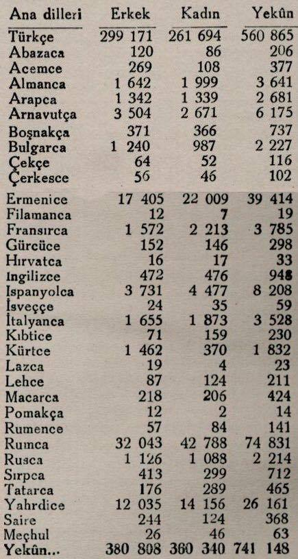
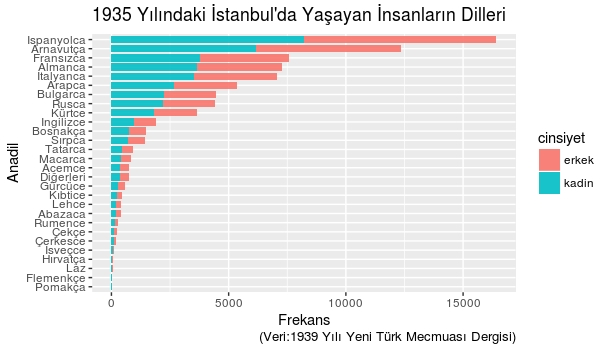

# languages_1935

## Overview

1935 Yılında İstanbul'da konuşulan diller üzerine yaptığım veri görselleştirme kodları

Twitter'da gezinirken denk geldiğim aşağıdaki görselle her şey başladı.

Görsel 1939 Yılındaki Yeni Türk Mecmuası Dergisinden alınmış. Her ne kadar 1939 yılında yayınlasa da 1935-1940 yılları arasında nufüs sayımının olmadığını görmedim. 1935 yılındaki İstanbul nüfusu bu verideki toplam frekansa çok yakın.

#### Aykırı Değerleri (Türkçe, Yahudi İspanyolcası(Ladino), Rumca ve Ermenice) çıkartıldığında

